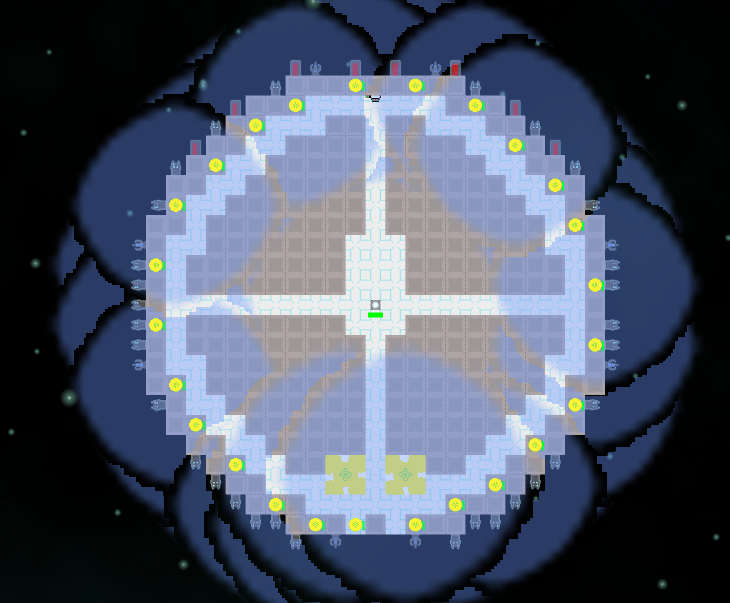
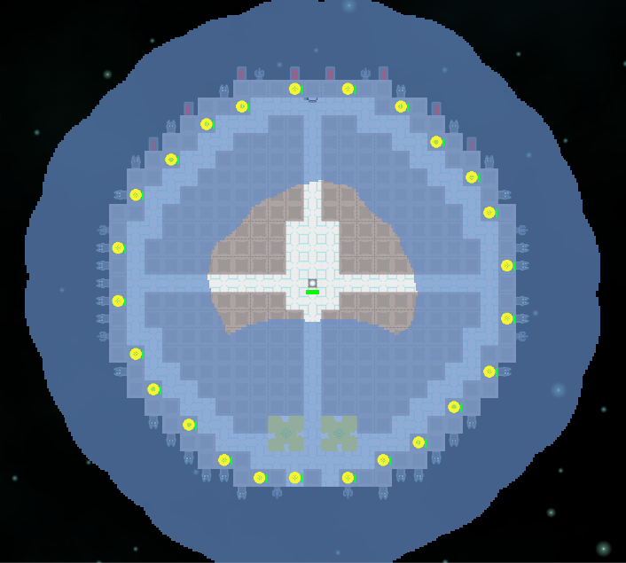

Let's say you have two overlapping circles. Instead of making something Venn diagram-esque, you'd rather they just marked out a continuous area.


In my particular case, I want the power node supply radius indicators on this hollow-asteroid-turned-into-a-spaceship not to obscure everything underneath them by being too intense at the overlap points:


This turns out to be *surprisingly difficult*. If it were just a matter of blending the two circles, you might accomplish it by using a Min shader [BlendOp](http://docs.unity3d.com/Manual/SL-Blend.html). However, what you want is to blend the circles one way and *then* blend the result of that blend in another way onto the screen. Since the rendering engine draws back-to-front, by the time you get to blending one circle onto another the first circle has already been blended with the scene and the necessary information lost.

## Using stencil tests

One method to avoid overlap is to tell the circle shader to just not do anything if another circle has already claimed a given pixel. This is where the [stencil buffer](http://docs.unity3d.com/Manual/SL-Stencil.html) comes in handy.

```cg
 Shader "Custom/PowerCircle" {
	 Properties {
	     _MainTex ("Base (RGB)", 2D) = "white" {}
	 }
	 
	 SubShader {
	    Tags { "Queue"="Transparent" }
	     
		Pass {
		    Stencil {
		        Ref 2
		        Comp NotEqual
		        Pass Replace
		    }

		     Blend SrcAlpha OneMinusSrcAlpha     
	 
			 CGPROGRAM
			 #pragma vertex vert
			 #pragma fragment frag
			 #include "UnityCG.cginc"
			 
			 uniform sampler2D _MainTex;
			 
			 struct v2f {
			     half4 pos : POSITION;
			     half2 uv : TEXCOORD0;
			 };
			 
			 v2f vert(appdata_img v) {
			     v2f o;
			     o.pos = mul (UNITY_MATRIX_MVP, v.vertex);
			     half2 uv = MultiplyUV( UNITY_MATRIX_TEXTURE0, v.texcoord );
			     o.uv = uv;
			     return o;
			 }

			 half4 frag (v2f i) : COLOR {
			     half4 color = tex2D(_MainTex, i.uv);
			     return color;
			 }
			 ENDCG
		}

	}
 
	Fallback off
}
```

The key here is the `Stencil` bit. `Comp NotEqual` means it will only run if the stencil buffer is not already equal to the number given by `Ref 2`, and `Pass Replace` means it will set it to 2 afterwards. So any number of this shader will only run once for a given pixel. Does it work? Well...


Not exactly, no. The problem is that each of the circles is actually a square sprite, and whoever renders first hogs all the pixels with useless completely transparent bits. We can fix this by telling the shader to discard any pixels with 0 alpha:

```cg
half4 frag (v2f i) : COLOR {
	half4 color = tex2D(_MainTex, i.uv);
	if (color.a == 0.0)
		discard;
	return color;
}
```



That's a little better! But we still have weird things going on around the edges. That would be because in this particular texture, the edges are soft and gradually fade out with decreasing alpha values. Since they're not *zero* alpha they don't get discarded, and can prevent higher-alpha pixels from other circles from being rendered.

We can eliminate the soft edges by editing the texture, and by ensuring the filter mode is set to `Point` rather than `Bilinear`:



Success! A continuous bubble of power.

Those soft edges were kinda nice to have, though. It's possible the result could be postprocessed somehow to add them back in, or a different strategy could retain them. For the moment, I've opted for a compromise of keeping the soft edges on the image and just discarding a bunch more low alpha pixels:

```cg
half4 frag (v2f i) : COLOR {
	half4 color = tex2D(_MainTex, i.uv);
	if (color.a < 0.3)
		discard;
	return color;
}
```


I think that looks kinda nice (for placeholder developer art). If anyone has any other ideas please let me know!

## Alternatives

From poking around the Unity forums it sounds like there may be a way to do this by making clever use of [ZTest and ZWrite](http://docs.unity3d.com/Manual/SL-CullAndDepth.html) that I didn't manage to puzzle out. The definitive solution is probably to use [RenderTexture](http://docs.unity3d.com/ScriptReference/RenderTexture.html) to blend the circles in advance and then drop them all in at once as a big sprite, but that requires adding more moving parts than I'd like.
